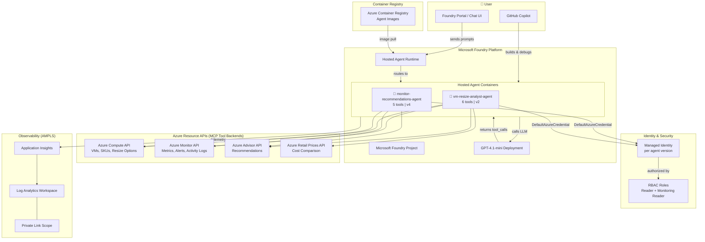

# Microsoft Foundry Hosted Agents — Reference Architecture

A hands-on reference repo demonstrating how **GitHub Copilot**, **Microsoft Foundry**, **Hosted Agents**, and **MCP (Model Context Protocol) tool connections** work together to build production AI agent systems on Azure.

Built as a learning accelerator for teams adopting agent-based architectures with Azure infrastructure.

---

## What This Repo Demonstrates

| Concept | What you'll learn |
|---------|-------------------|
| **GitHub Copilot** | Used as the AI pair-programmer to build, debug, and iterate on agents in real time |
| **Microsoft Foundry** | The platform for hosting, managing, and scaling AI agents with built-in identity & observability |
| **Hosted Agents** | Containerized agent applications with managed identity, auto-scaling, and tool execution |
| **Agent Framework** | Python-based tool registration, LLM orchestration, and the Responses protocol |
| **MCP Connections** | How agents connect to Azure services (Monitor, Compute, Advisor) as tool backends |
| **AMPLS (Private Link)** | Secure, private observability pipeline across subscriptions |
| **Evaluation** | Reusable Jupyter notebook for testing any hosted agent end-to-end |

---

## Architecture



---

## How the Systems Connect

### 1. GitHub Copilot → Agent Development

GitHub Copilot acts as the development accelerator. It was used to:
- Scaffold agent code, Dockerfiles, and manifests
- Debug Azure SDK issues (e.g., ISO 8601 time grain vs Python `timedelta`)
- Automate RBAC role assignments and container builds
- Generate the evaluation notebook

The `.github/copilot-instructions.md` file captures all lessons learned, so Copilot retains context across sessions.

### 2. Microsoft Foundry → Agent Hosting

Foundry provides the managed platform for running agents:
- **Project** — logical container for agents, models, and connections
- **Hosted Agent Runtime** — pulls container images from ACR, manages lifecycle
- **Model Deployments** — GPT-4.1-mini used by agents for reasoning
- **Managed Identity** — each agent version gets a unique identity for RBAC

### 3. Hosted Agents → Tool Execution (MCP Pattern)

Each agent is a Python container that implements the **Responses Protocol**:

```
User Prompt → Foundry Runtime → Agent Container → LLM (tool selection)
                                       ↓
                              Execute Tool (Azure SDK call)
                                       ↓
                              Tool Result → LLM → Final Response
```

Tools are Python functions that call Azure Resource Manager APIs using the agent's managed identity. This is the **MCP connection pattern** — the agent connects to external services (Monitor, Compute, Advisor) as tool backends, authenticated via `DefaultAzureCredential`.

### 4. RBAC → Secure Access

Each agent version gets a new managed identity. Required roles:

| Role | Scope | What it enables |
|------|-------|-----------------|
| `Reader` | Subscription | List VMs, SKUs, Advisor recommendations |
| `Monitoring Reader` | Subscription | Query Azure Monitor metrics data-plane |
| `Cognitive Services User` | AI Services account | Foundry API access (if calling other agents) |

### 5. AMPLS → Private Observability

Azure Monitor Private Link Scope ensures telemetry from agents flows over private endpoints, not the public internet. The Bicep templates in `infra/` deploy this cross-subscription.

---

## Hosted Agents

### 🤖 monitor-recommendations-agent (v4)

Collects raw Azure infrastructure data — metrics, alerts, activity logs, and Advisor recommendations.

| Tool | Description |
|------|-------------|
| `list_vms` | List VMs in subscription/resource group |
| `get_monitor_metrics` | Query CPU, memory, disk metrics |
| `get_monitor_alerts` | Active alerts for a resource |
| `get_activity_log` | Recent management operations |
| `get_advisor_recommendations` | Cost/performance/security recommendations |

### 🤖 vm-resize-analyst-agent (v2)

Analyzes metrics and recommendations to give users actionable resize options with cost comparisons.

| Tool | Description |
|------|-------------|
| `list_vms` | List VMs with size and location |
| `get_monitor_metrics` | Historical CPU/memory utilization |
| `get_advisor_recommendations` | Right-size recommendations |
| `get_available_vm_skus` | Available sizes in a region |
| `get_vm_resize_options` | Valid resize targets for a specific VM |
| `estimate_cost_comparison` | Price comparison between two SKUs |

### Why Two Agents?

| Pattern | Pros | Cons |
|---------|------|------|
| Single agent with all tools | Simpler deployment, one identity | Larger container, all-or-nothing updates |
| Multi-agent (separate containers) | Independent scaling, focused prompts | Inter-agent calls are complex in Foundry |
| Multi-agent (embedded tools) ✅ | Independent agents, no call overhead | Some tool duplication |

We chose **embedded tools** — each agent carries its own tools rather than calling the other. This avoids the complexity of inter-agent HTTP calls in the current Foundry SDK.

---

## Agent Evaluation Checklist

A reusable Jupyter notebook (`agent-evaluation-checklist.ipynb`) that validates any hosted agent across 5 areas:

| Section | Tests | Example Output |
|---------|-------|----------------|
| 1️⃣ Infrastructure | ACR image, agent registration, version status | ✅ Agent version active — v2 status=active |
| 2️⃣ Identity & RBAC | Managed identity, role assignments | ✅ RBAC: Monitoring Reader — scope=subscription |
| 3️⃣ Tool Connectivity | Live API calls to each backend | ✅ Compute API accessible — 1161 VM sizes |
| 4️⃣ Tool Selection | LLM picks correct tool per prompt | ✅ Tool selection accuracy: 6/6 (100%) |
| 5️⃣ End-to-End | Full agent loop: prompt → tool → response | ✅ Response: 5 VMs found, 577 chars |

### Running Locally

```powershell
# Install dependencies
pip install jupyter azure-identity azure-ai-projects azure-mgmt-compute azure-mgmt-monitor azure-mgmt-advisor

# Login to Azure
az login

# Option 1: Interactive in browser
python -m notebook agent-evaluation-checklist.ipynb

# Option 2: Headless execution
python -m nbconvert --to notebook --execute agent-evaluation-checklist.ipynb --output results.ipynb
```

### Customizing for Your Agent

Edit the `AGENT_CONFIG` cell:
```python
AGENT_CONFIG = {
    "agent_name": "your-agent-name",
    "expected_tools": ["tool1", "tool2"],
    "required_roles": [{"role": "Reader", "scope": "subscription"}],
    "tool_selection_tests": [
        ("Your test prompt", "expected_tool_name"),
    ],
}
```

---

## Repository Structure

```
ampls-mcp-test/
├── README.md                         # This file
├── .github/
│   └── copilot-instructions.md      # Lessons learned & patterns (Copilot context)
│
├── agent-monitor-recommendations/    # Agent 1: Data collection
│   ├── main.py                       # Tool implementations
│   ├── Dockerfile
│   ├── requirements.txt
│   └── README.md
│
├── agent-vm-resize-analyst/          # Agent 2: Analysis & recommendations
│   ├── main.py                       # 6 tools with Azure SDK calls
│   ├── Dockerfile
│   ├── agent.yaml                    # CPU/memory config
│   ├── agent.manifest.yaml           # Foundry registration manifest
│   ├── .foundry/agent-metadata.yaml
│   ├── .env.example
│   └── README.md
│
├── agent-evaluation-checklist.ipynb   # Reusable agent validation notebook
│
├── infra/                            # AMPLS observability infrastructure
│   ├── subA-observability.bicep
│   └── modules/
│       └── observability.bicep
│
├── scripts/
│   └── deploy-subA.ps1              # Subscription A deployment
│
├── foundry-project/
│   └── README.md                    # Foundry project setup guide
│
└── outputs/
    └── .gitkeep
```

---

## Quick Start

### Prerequisites

- [Azure CLI](https://aka.ms/installazurecli) (v2.60+)
- [Azure Developer CLI (azd)](https://aka.ms/azure-dev/install)
- Python 3.10+
- Owner or Contributor role on your Azure subscription

### Replace Placeholders

Before deploying, replace these placeholders throughout the repo with your actual values:

| Placeholder | Description |
|-------------|-------------|
| `<subscription-a-id>` | Your Azure subscription ID |
| `<your-acr>` | Azure Container Registry name (e.g., `myregistry`) |
| `<your-ai-account>` | Foundry AI account name (appears in project endpoint URL) |
| `<your-project-name>` | Foundry project name |
| `<your-resource-group>` | Resource group for Foundry resources |
| `<monitor-agent-principal-id>` | Principal ID of the monitor-recommendations-agent version |
| `<resize-agent-principal-id>` | Principal ID of the vm-resize-analyst-agent version |

### 1. Provision Foundry Project

```powershell
cd foundry-project
azd init -t https://github.com/Azure-Samples/azd-ai-starter-basic -e my-project --no-prompt
azd env set AZURE_LOCATION eastus2
azd env set ENABLE_HOSTED_AGENTS true
azd provision --no-prompt
```

### 2. Build & Deploy an Agent

```powershell
# Build container image
az acr build --registry <your-acr> --image vm-resize-analyst-agent:latest ./agent-vm-resize-analyst/

# Register agent version (Python)
python -c "
from azure.ai.projects import AIProjectClient
from azure.identity import DefaultAzureCredential

client = AIProjectClient(endpoint='<your-project-endpoint>', credential=DefaultAzureCredential())
client.agents.create_version(
    agent_name='vm-resize-analyst-agent',
    headers={'Foundry-Features': 'HostedAgents=V1Preview'},
    definition={
        'kind': 'hosted',
        'container_protocol_versions': [{'protocol': 'responses', 'version': '1.0.0'}],
        'cpu': '0.5', 'memory': '1Gi',
        'image': '<your-acr>.azurecr.io/vm-resize-analyst-agent:latest',
        'environment_variables': {'AZURE_AI_MODEL_DEPLOYMENT_NAME': 'gpt-4.1-mini'},
    }
)
"
```

### 3. Assign RBAC

```powershell
# Get the agent's principal_id from the version, then:
az role assignment create --assignee "<principal_id>" --role "Reader" --scope "/subscriptions/<sub_id>"
az role assignment create --assignee "<principal_id>" --role "Monitoring Reader" --scope "/subscriptions/<sub_id>"
```

### 4. Validate with Evaluation Notebook

```powershell
pip install jupyter azure-identity azure-ai-projects azure-mgmt-compute azure-mgmt-monitor azure-mgmt-advisor
python -m notebook agent-evaluation-checklist.ipynb
```

---

## Lessons Learned

Key gotchas documented in `.github/copilot-instructions.md`:

| Issue | Root Cause | Fix |
|-------|-----------|-----|
| Metrics query fails | `interval=timedelta(hours=1)` | Use ISO 8601: `"PT1H"` |
| Agent can't list VMs | Missing `Reader` role | Assign on subscription scope |
| Agent can't query metrics | `Reader` ≠ metrics access | Add `Monitoring Reader` |
| New version, same error | Each version = new identity | Re-assign RBAC to new principal_id |
| Inter-agent calls fail | Hosted agents aren't "applications" | Embed tools directly |
| `preview_feature_required` | Missing header | Add `Foundry-Features: HostedAgents=V1Preview` |

---

## Deploy Observability (AMPLS)

For private telemetry routing across subscriptions:

```powershell
# Deploy Log Analytics + App Insights + DCE
pwsh -ExecutionPolicy Bypass -File ./scripts/deploy-subA.ps1 -SubA "<subscription-a-id>" -Location "eastus2"
```

See `infra/` for Bicep templates and `foundry-project/README.md` for project setup.

---

## License

MIT
